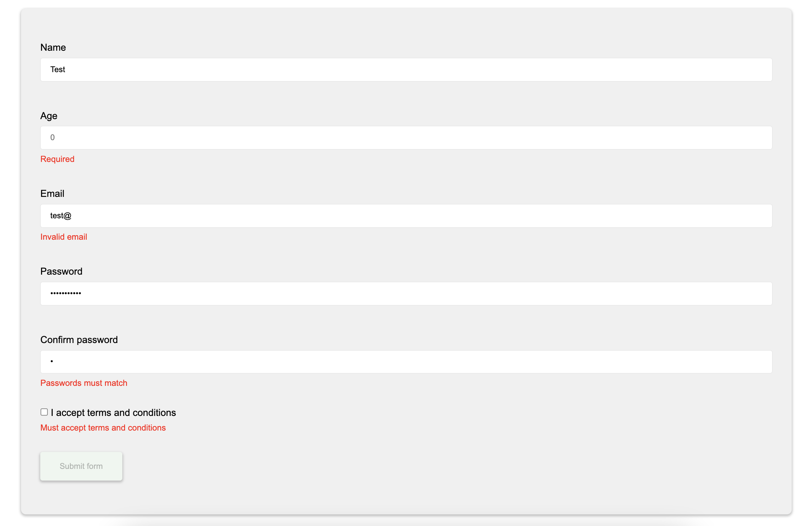

# Custom form validator example
Javascript form validator + Zod.



## Setup
Run `index.html` with [Live Server](https://ritwickdey.github.io/vscode-live-server/)

---

## Usage

##### 1. Create a form element with a `form-validator` class and set the `data-schema` attribute.
```html
<html>
    <form class="form-validator" data-schema="formExample">
    </form>
</div>
```

##### 2. Create the field containers and set the `data-validator` attribute for them:
```html
<html>
    <form class="form-validator" data-schema="formExample">
        <div class="field-container" data-validator="name">
            <input type="text" name="name">
            <p class="error"></p>
        </div>

        <div class="field-container" data-validator="age">
            <input type="number" name="age">
            <p class="error"></p>
        </div>

        <div class="field-container">
            <button type="submit" disabled>Submit form</button>
            <p class="error"></p>
        </div>
    </form>
</div>
```

##### 3. Create a zod schema and export it in the `SCHEMAS` object

The `data-schema` attribute is used here to get which zod schema should be used to validate the form.

The `data-validator` attributes are used to identify each field in the schema.

```js
// schemas.js

const formSchema = z.object({
    name: z.string().max(100),
    age: z.coerce.number().min(0).max(999),
})

export const SCHEMAS = Object.freeze({
    formExample: formSchema,
});
```